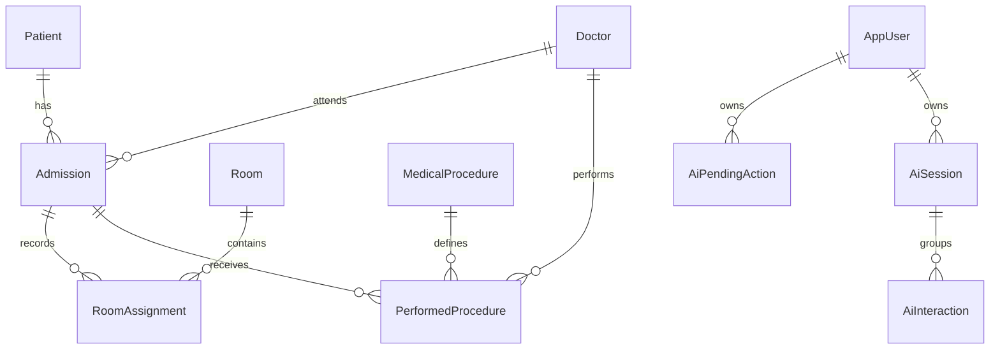

# Architecture and implementation decisions

## System boundary

The Next.js App Router frontend communicates with Spring Boot through same-origin `/api/v1` requests. Next.js rewrites the API path to the Java service in development and production. Spring Boot is packaged as an executable WAR with embedded Tomcat and is also deployable to an external Tomcat 10.1 server. PostgreSQL is the sole authoritative store. Hibernate is configured with schema validation; Flyway owns schema changes. The service layer runs authorization and validation regardless of caller.

```mermaid
flowchart TD
  U[Next.js interface] --> A[Spring Security]
  U --> C[Assistant controller]
  C --> M[Configured model adapter]
  M --> T[Validated tool registry]
  T --> A
  A --> S[Business services]
  S --> P[PostgreSQL]
  T --> Q[Pending proposal]
  Q --> H[Human confirmation]
  H --> A
```

The diagram shows policy boundaries; assistant requests themselves also pass through Spring Security before reaching the controller. The registry does not call repositories: it calls the business services and `AiActionService`.

Each business service owns one area and holds the real method bodies for it: `StayService` the admission lifecycle (admission, transfer, discharge, attending doctor, recorded procedures) and the admission dossier, `ReportService` the dashboard, census, capacity and procedure reporting, `PatientService` patient records and their dossiers, `CatalogueService` doctors, rooms and procedures, and `WorkspaceService` hospitals, departments and membership. `HospitalService` is the shared layer underneath them: department-scoped access checks (`accessible`, `visible`) and the entity lookups the others build on. Controllers and the assistant call the owning service, never a pass-through.

## Relational model



JPA models use scalar foreign-key identifiers to avoid accidental recursive entity serialization; PostgreSQL foreign keys enforce the relationships. Entity state is private and reached through accessors, so persistence and JSON mapping stay on a declared surface instead of open fields. All domain records have identity, creation/update timestamps and an optimistic `version`. Historical records cannot silently lose referenced catalogue entries. Catalogue entities and accounts are deactivated through validated updates rather than hard-deleted.

Hospitals own departments. Staff join a hospital or a department with a rotating code. Hospital membership alone does not open clinical records; a department code grants medical staff access without administrator rights. Codes can expire and can be issued as single-use invites; joining with a single-use code rotates it immediately. Clinical tables carry `department_id` and Hibernate filters every load, including lookups by primary key.

Partial unique indexes enforce one active admission per patient and one unreleased room assignment per admission. Bed availability derives from unreleased assignments; it is not a separate stored counter. Procedure prices are copied into `priceAtExecution` at recording time.

## Transactions and concurrency

`WorkflowLockRepository.acquire()` takes a pessimistic write lock on the **current department's** pre-created `workflow_lock` row (id = `department_id`). Admission, transfer, discharge, doctor reassignment, procedure recording, room capacity edits, doctor deactivation and account administration acquire this lock before checking current state. The lock persists until transaction completion. It serializes department-level writes and avoids lock-order deadlocks across source/destination rooms; ordinary reads remain concurrent. Cross-department operations (demo reset) call `acquireAll()` and lock every row in id order, including the global sentinel (`id = 0`). New departments insert a matching lock row in the same transaction.

A transfer releases the previous assignment, flushes it, inserts the next assignment, increments the admission version and writes an audit event in one transaction. Failure rolls the entire operation back. Discharge updates status, closes the assignment and releases the bed in one transaction. Existing-record edits require the version last displayed to the user.

Clinical records are isolated per department, and the write lock is now department-scoped so an admission in Hospital A no longer blocks transfers in Hospital B.

## Access policy

| Operation | ADMIN | MEDICAL_STAFF | DOCTOR |
| --- | --- | --- | --- |
| Patient directory/details | All | All | Patients with admissions assigned to that doctor |
| Patient history | All | All | Only the doctor's assigned admissions |
| Patient create/edit | Yes | Yes | No |
| Admission / transfer / discharge / doctor reassignment | Yes | Yes | No |
| Procedure recording | Yes | Yes | Own assigned admission; own physician ID |
| Room capacity and doctor/catalogue directory | Read/write | Read | Read |
| Procedure reports | All | All | Assigned-admission scope |
| Department bed counts | Yes | Yes | Yes, without other patient identities |
| User administration / audit screen | Yes | No | No |
| AI read tools | Authorized scope | Authorized scope | Authorized scope |
| AI prepared changes | Yes | Yes | No |

A doctor who previously attended a patient may still see demographics if a historical admission remains assigned to them, but other doctors' admissions are filtered out. The dashboard explicitly distinguishes assigned-admission counts from department-wide capacity.

Session authentication uses Spring Security's form-login filter, session-fixation protection, logout invalidation and default CSRF protection. The Next.js client obtains a BREACH-protected token from `/auth/csrf`, sends it as a header for unsafe methods and refreshes it after login. Cookies are HttpOnly, SameSite Strict and Secure by default outside local Compose. Account enabled status and roles are reloaded for every authenticated request. Password resets invalidate credential stamps on existing real login sessions. Password hashes are excluded from JSON.

## AI control

The model returns a single `ToolCall`, never executable HTML or SQL. An explicit registry validates the tool name, allowed argument keys, string types, bounds and role before invoking services. Tool definitions for doctors exclude write preparation, and the registry independently enforces that restriction. Navigation destinations use a server allow-list and a client route check.

The default local command model requires no network. The external adapter implements the chat-completions function-tool envelope. It sends no bulk database dump and does not run a second generative pass over clinical notes. Summaries and report cards describe returned records directly. This keeps calculated totals authoritative and treats notes as display data, not instructions.

The default limit is 20 requests per user per minute and one in-flight request per user per application process. The limiter is isolated from CRUD APIs. Counters for both the assistant and registration confirmation emails persist in the `rate_windows` Postgres table so a restart or a second backend instance keeps the same window.

Pending actions persist a server-built immutable payload, owner, creation time, expiry and status. The model cannot call confirmation. The confirmation endpoint checks current role, ownership, pending state, expiry, admission version, active status and current capacity. The confirmation and hospital mutation share one transaction. Expired proposals are persisted as expired while returning `409 ACTION_EXPIRED`; ordinary workflow errors retain their specific conflict response and roll back. Successful proposals become `EXECUTED`; replay is rejected. Cancellation is owner-only.

Only AI operational metadata is retained: tool, model, duration, owner, session and outcome. User prompt text and full AI context are not stored. Clearing a session clears selected-patient context and the transient UI conversation; existing audit metadata is retained. No raw notes, passwords, session cookies or prompts are emitted in audit metadata.

## Interface and failure behavior

The UI uses the Next.js App Router, TanStack Query, React Hook Form, Zod, application CSS and Motion. Mutations invalidate authoritative queries. Success feedback follows successful server responses only. Native dialogs provide keyboard focus containment and Escape handling. CSS and Motion honor reduced-motion preference. Reports use UTC date boundaries; record timestamps display in the browser's local time.

Assistant failure returns a typed `ERROR`; the rest of the application continues. The dashboard's assistant request is independent from its metric queries. Frontend state does not persist patient records in browser storage. Streaming is not enabled: one validated structured result is returned per request. Streaming and cross-request caching are optional features in the plan and unnecessary for correctness.
